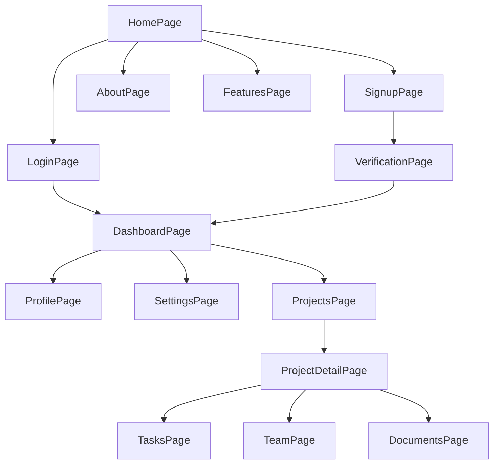
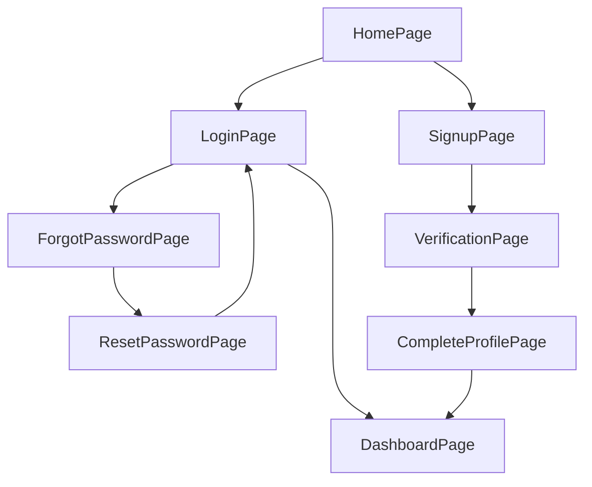
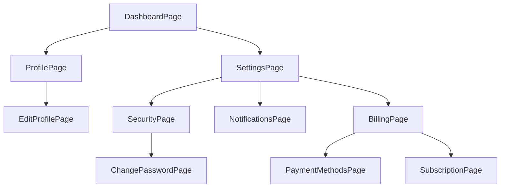

# Application Page Flow

This document provides a visual representation of the application's pages and the navigation paths between them.

## Main Page Navigation

## User Authentication Flow

## Account Management Flow

## Notes

- This flowchart represents the primary pages and navigation paths in the application
- Focus on page-to-page transitions rather than detailed component interactions
- Update this flowchart whenever new pages are added or navigation paths change

## Best Practices

- Keep page navigation intuitive and consistent
- Minimize the number of clicks to reach important pages
- Ensure users can easily navigate back to key pages (like Dashboard)
- Use clear and descriptive page names in both the diagram and application
