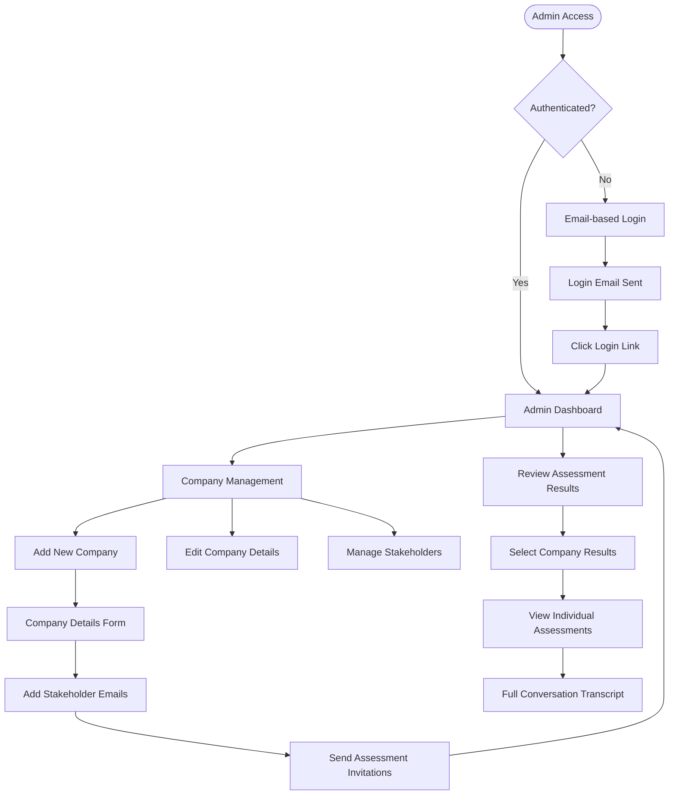
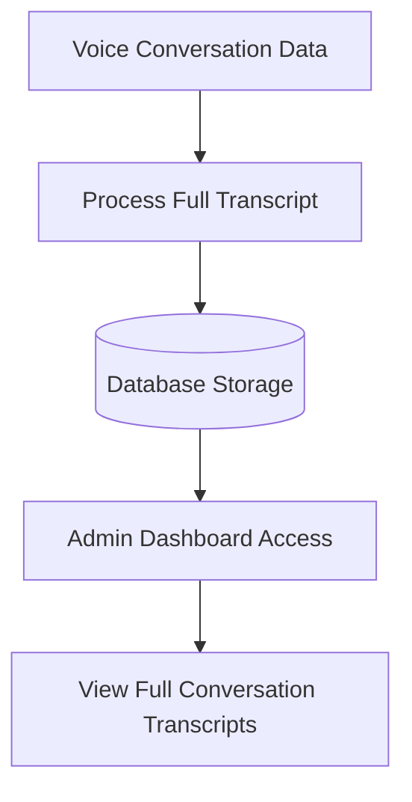
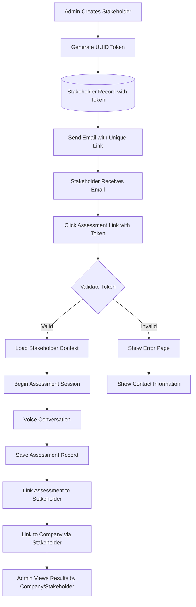

# AI Assessment Assistant - Application Flow

This document provides a visual representation of the application's user flows and navigation paths for both administrators and assessment participants.

## Complete User Journey Overview

```mermaid
flowchart TD
    Start([Admin starts assessment program]) --> AdminLogin[Admin Login via Email]
    AdminLogin --> AdminDashboard[Admin Dashboard]
    
    AdminDashboard --> CreateCompany[Create New Company]
    CreateCompany --> AddStakeholders[Add Stakeholder Emails]
    AddStakeholders --> SendInvitations[Send Email Invitations]
    
    SendInvitations --> EmailSent[Invitation Emails Sent]
    EmailSent --> StakeholderEmail[Stakeholder Receives Email]
    
    StakeholderEmail --> AssessmentLanding[Assessment Landing Page]
    AssessmentLanding --> StartButton[Click "Start Assessment" Button]
    StartButton --> MicPermission[Request Microphone Permission]
    MicPermission --> VoiceInterface[Voice Conversation Interface]
    
    VoiceInterface --> DataCollection[AI Gathers Information]
    DataCollection --> TranscriptDisplay[Real-time Transcript Display]
    TranscriptDisplay --> UserFinish[User Clicks "Finish Assessment"]
    
    UserFinish --> ThankYou[Thank You Page]
    ThankYou --> DataStorage[Conversation Stored]
    
    DataStorage --> AdminReview[Admin Reviews Results]
    AdminReview --> AdminDashboard
```

## Admin Flow



## Stakeholder Assessment Flow

```mermaid
flowchart TD
    EmailInvite[Receive Email Invitation] --> ClickLink[Click Assessment Link]
    ClickLink --> LandingPage[Assessment Landing Page]
    
    LandingPage --> Instructions[Welcome & Instructions]
    Instructions --> StartButton[Click "Start Assessment" Button]
    
    StartButton --> MicCheck[Microphone Permission Request]
    MicCheck -->|Granted| VoiceReady[Voice Interface Ready]
    MicCheck -->|Denied| MicError[Microphone Error Page]
    MicError --> MicCheck
    
    VoiceReady --> AIGreeting[AI Agent Greeting]
    AIGreeting --> ConversationFlow[Structured Conversation]
    
    ConversationFlow --> RoleQuestions[Role & Responsibilities]
    RoleQuestions --> MetricsQuestions[Key Metrics Discussion]
    MetricsQuestions --> TechStackQuestions[Technology Stack Review]
    TechStackQuestions --> AIAdoptionQuestions[Current AI Usage]
    AIAdoptionQuestions --> OrganizationalQuestions[Organizational Readiness]
    OrganizationalQuestions --> ChallengesQuestions[Challenges & Roadblocks]
    
    ChallengesQuestions --> UserDecision[User Decides to Finish]
    UserDecision --> FinishButton[Click "Finish Assessment" Button]
    FinishButton --> CompletionMessage[Assessment Complete]
    CompletionMessage --> ThankYouPage[Thank You Page]
```

## Voice Interface Detailed Flow

```mermaid
flowchart TD
    VoiceStart([Voice Interface Activated]) --> AIIntro[AI Introduction & Context Setting]
    
    AIIntro --> Question1[Ask about role and responsibilities]
    Question1 --> Response1[User voice response]
    Response1 --> Transcript1[Display transcript in real-time]
    
    Transcript1 --> Question2[Ask about key metrics]
    Question2 --> Response2[User voice response]
    Response2 --> Transcript2[Update transcript]
    
    Transcript2 --> Question3[Ask about technology stack]
    Question3 --> Response3[User voice response]
    Response3 --> Transcript3[Update transcript]
    
    Transcript3 --> Question4[Ask about AI adoption]
    Question4 --> Response4[User voice response]
    Response4 --> Transcript4[Update transcript]
    
    Transcript4 --> Question5[Ask about organizational readiness]
    Question5 --> Response5[User voice response]
    Response5 --> Transcript5[Update transcript]
    
    Transcript5 --> Question6[Ask about challenges]
    Question6 --> Response6[User voice response]
    Response6 --> FinalTranscript[Final transcript update]
    
    FinalTranscript --> UserClicksFinish[User Clicks "Finish Assessment"]
    UserClicksFinish --> SaveData[Save complete conversation]
    SaveData --> EndInterface[End voice interface]
```

## Data Collection & Storage Flow



## Stakeholder Identification & Data Linking Flow



## Notes

- The voice interface maintains real-time transcript display throughout the conversation
- Each assessment is linked to a specific company and stakeholder for proper data organization through UUID tokens
- The AI agent is trained to guide conversation toward specific data collection goals and uses company custom instructions when provided
- Complete conversation transcripts are stored securely with proper access controls
- The system supports multiple stakeholders per company assessment (but each stakeholder can only complete one assessment)
- Unique UUID tokens ensure secure stakeholder identification without exposing sensitive data in URLs
- User controls when the conversation starts (Start Assessment button) and ends (Finish Assessment button)
- Assessment invitation links remain valid indefinitely (no expiration)

## Best Practices

- Keep the voice interface simple and intuitive
- Provide clear instructions before starting voice conversation
- Handle microphone permission gracefully with retry options after user indicates intent
- Ensure real-time transcript accuracy and responsiveness
- Maintain secure data storage and access controls
- Design for scalability with multiple concurrent assessments
- Use cryptographically secure UUID tokens for stakeholder identification
- Provide clear "Start Assessment" and "Finish Assessment" buttons for user-controlled experience
- Incorporate company custom instructions into AI agent conversation approach